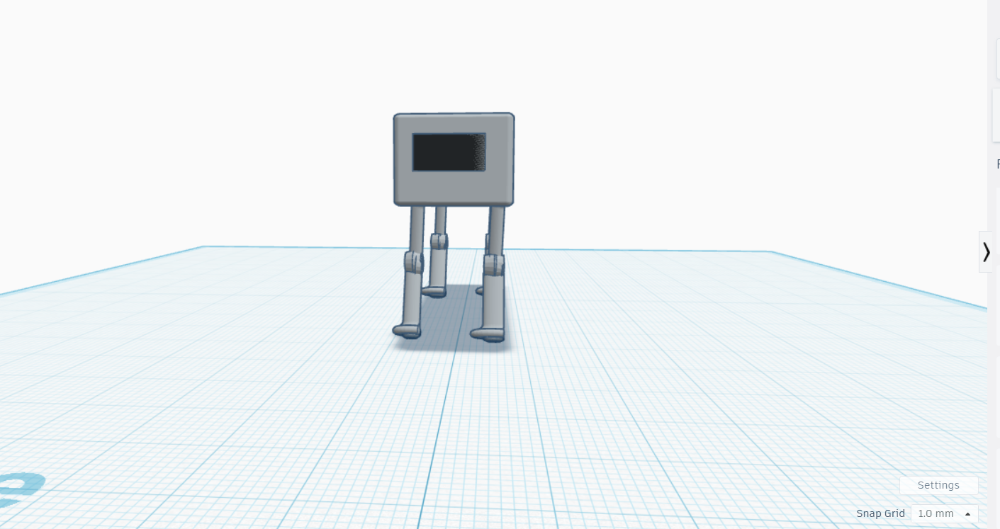
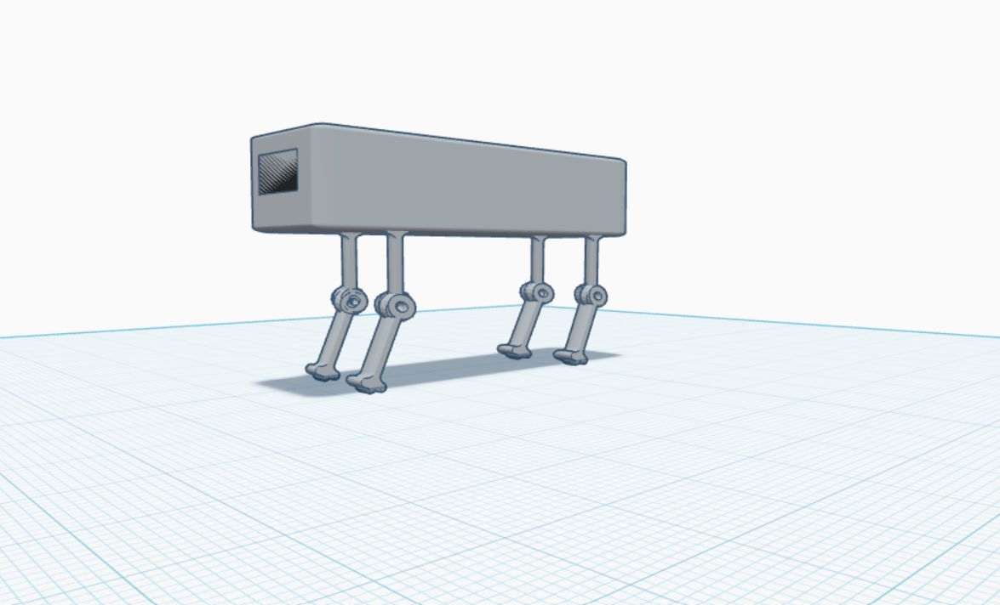
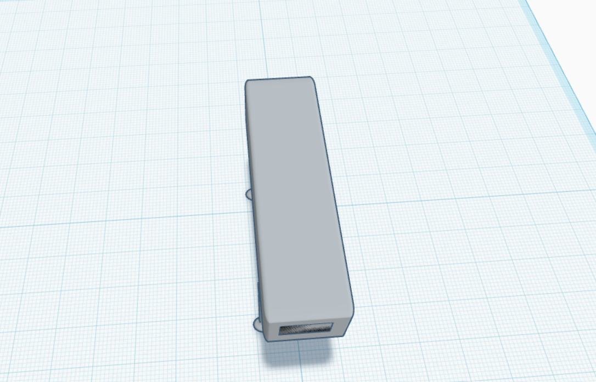

# 🤖 Robot Dog Design

## Overview
This repository contains the 3D mechanical design of a quadruped robot (Robot Dog) created using Tinkercad.

The project focuses on designing the robot's body and legs while considering joint placement, stability, and overall mechanical structure.

---
## Design Preview

### Front View

### Side View

### Top View

---
## Project Objectives
- Design a simple four-legged robot.
- Create a stable mechanical structure.
- Include leg joints for movement.
- Prepare the design for future servo motor integration.

---

## Software Used
- Tinkercad

---

## Project Files
- 3D Model (.STL)
- Design Images
- README Documentation

---

## Features
- Four-legged robot design.
- Mechanical joints.
- Stable body structure.
- Ready for future development.

---

## Author
Sara Rezgi
